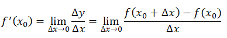
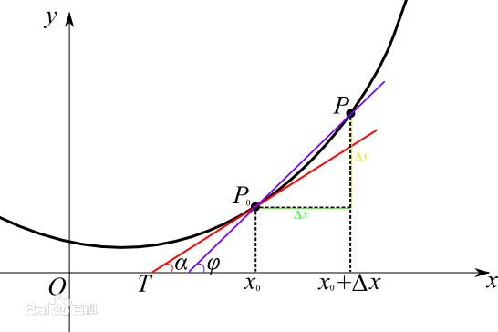
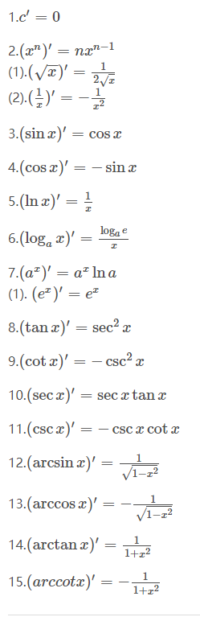

###一、环境准备
1. 安装Python
   
    在Python的官网上 https://www.python.org/ 下载Python的安装包进行安装

2. 安装Anaconda

    在Anaconda的官网上 https://www.anaconda.com/ 下载安装包

###二、基础回顾

**1. 导数**
我们知道导数的定义如下：

=$\frac{\delta(y)}{\delta(x)}$

反映的是函数y=f(x)在某一点处沿x轴正方向的变化率/变化趋势。直观地看，也就是在x轴上某一点处，如果f’(x)>0，说明f(x)的函数值在x点沿x轴正方向是趋于增加的；如果f’(x)<0，说明f(x)的函数值在x点沿x轴正方向是趋于减少的。
从物理的角度看，对二维坐标系，若横轴为时间t，纵轴为运动距离s的话，导数则是该时刻的瞬时速率。
用图表示则如下：

上图中的Δy、dy等符号的意义及关系如下： 
Δx:x的变化量； 
dx:x的变化量Δx趋于0时，则记作微元dx； 
Δy:Δy=f(x0+Δx)-f(x0)，是函数的增量； 
dy:dy=f’(x0)dx，是切线的增量； 
当Δx→0时，dy与Δy都是无穷小，dy是Δy的主部，即Δy=dy+o(Δx). 

**2. 导数公式**
   
[1]  $$\frac{\delta(f(x)g(x))}{\delta x}=f(x)g'(x)+f'(x)g(x)$$

[2]  $$\frac{\delta(f(g(x))}{\delta x}=f'(g(x))'g'(x)$$

[3]  $$\frac{\delta(f(x)+g(x))}{\delta x}=f'(x)+g'(x)$$

按照上述的公式，即可得到基本上所有可导函数的导数。关于上面几个式子的证明，如果感兴趣，可以网上搜索导数公式的证明。

**3. 常见函数的导数**
   
   常见的初等函数导数公式如下：
   
   
   
搭配导数公式和常见函数的导数，基本上就能够计算出大多数的导数。特殊函数的导数可以再讨论。

练习题：求下列函数式的导数
1)$y=3x^2+5x+8$

2)$y=\frac{1}{1+e^{-x}}$

3)$y=\frac{1}{1+e^{-2x^2}}$

4)$y=ln(\frac{1}{1+e^{-x}})$

5)$y=\frac{2x^2}{1+x}$

**4. 向量和矩阵**
向量的定义：向量是既有大小，又有方向的量。
最直观的在二维坐标系里面，x轴和y轴代表平面两个垂直的方向，如$\vec{a}=\left[ \begin{matrix} 1,2 \end{matrix} \right ]^T$ 表示$\vec{a}=1* \vec{i_x}+2*\vec{i_y}$,其中$\vec{i_x}$和$\vec{i_y}$分别是单位x和y方向上的单位向量，分别表示指向x轴和y轴的正方向，但是其长度为1。前面的表示$\vec{a}=\left[ \begin{matrix} 1,2 \end{matrix} \right ]^T$是简写，一般会将单位方向向量省去。
在三维坐标系里面，x、y、z轴代表的是空间上三个互相垂直的方向，如：
$\vec{a}=\left[ \begin{matrix} 1,2,3 \end{matrix} \right ]^T$表示$\vec{a}=1*\vec{i_x}+2*\vec{i_y}++3*\vec{i_z}$
将这个概念拓展到多维，任意维度的向量表示为:
$\vec{a}=\left[ \begin{matrix} a_1,a_2,a_3,……,a_n \end{matrix} \right ]^T$
其中$a_i$是在$i$方向上的坐标。

矩阵则可看做是由一系列向量组成。如矩阵

$A=\left[ \begin{matrix} 1 &2 &3 &4  \\ 2&3&6&8 \\ 6 &7 &10&12 \end{matrix} \right]_{3 \times 4}$

矩阵A是一个$3\times4$的矩阵，可以说由3个行向量组成，或者4个列向量组成。

第一个列向量为:
$\vec{c_1}=\left[ \begin{matrix} 1 \\2 \\6 \end{matrix} \right]$

第一个行向量为：
$\vec{r_1}=\left[ \begin{matrix} 1 &2&3&4 \end{matrix} \right]$

**5. 矩阵运算与向量运算**
矩阵乘法的定义：
矩阵的乘法，是左边矩阵的行的每个元素与右边矩阵的列的每个对应元素相乘，然后相加。
如:
$A=\left[ \begin{matrix}1&2\end{matrix}\right],B=\left[ \begin{matrix}3\\4\end{matrix}\right]$,有
$A*B=1*3+2*4=\left[ \begin{matrix}11\end{matrix}\right]$

矩阵运算的公式:
1)矩阵乘以一个常数，是对矩阵的每个元素乘以该常数
如：
$3*A=\left[ \begin{matrix}3*1&3*2\end{matrix}\right]=\left[ \begin{matrix}3&6\end{matrix}\right]$

2)满足加法交换律和结合律
$A+B=B+A$
$(A+B)+C=A+(B+C)$

3)满足乘法结合律和分配律
$ABC=A(BC)$
$A(B\pm C)=AB \pm AC$
$(\lambda A)B=\lambda (AB)$

4)矩阵的转置
矩阵的转置就是将矩阵的行变为列，列变为行，在运算可行的条件下，满足以下性质：
$(A')'=A$
$(AB)'=B'A'$
$(A+B)'=A'+B'$
$(\lambda A)'=\lambda A'$

5）矩阵的求导
矩阵求导的法则不能直接照搬函数的求导法则，因为矩阵较为复杂。关于矩阵的求导有以下公式：

$d(A\pm B)=dA\pm dB$

$d(AB)=(dA)B+A(dB)$

$d(A)^T=(dA)^T$

$d(A\cdot B)=dA\cdot B+A\cdot dB$ 其中点乘表示逐元素乘法

$df(A)=f'(A)\cdot dA$ 其中$f'(A)$是对$A$中的每个元素都求导

以上就是后面课程所需要用到的一些基本知识，如果后续有用到更多的内容，就进行再补充。