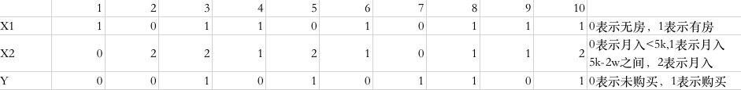

###朴素贝叶斯的基本理论

逻辑回归算法本身适合于二分类的问题。在涉及多分类的问题时，需要将逻辑回归算法进行拓展才能实现多分类。而朴素贝叶斯算法本身就适合

####1、贝叶斯理论
#####1)朴素贝叶斯的核心
贝叶斯理论的核心就是一个公式：
$$P(B|A)P(A)=P(AB)=P(A|B)P(B)$$
该公式的含义为:事件A发生的条件下事件B发生的概率等于事件A和B同时发生的概率除以事件A发生的概率。

举个例子：事件A=掷骰子的点数为偶数，B=掷骰子的点数为2，那么:$P(A)=\frac{1}{2}$,$P(B)=\frac{1}{6}$
那么事件：掷骰子的点数为偶数的条件下点数为2的概率为$\frac{1}{3}$,因为为偶数的点数只有3种可能：{2，4，6}，那么为2的概率即为$P(B|A)=\frac{1}{3}$
而点数为偶数且点数为2的事件概率为:$P(AB)=\frac{1}{6}$
所以：$P(B|A)=P(AB)/P(A)=\frac{1}{6}/\frac{1}{2}=\frac{1}{3}$
在公式的右侧，则有：$P(A|B)$表示事件B发生的条件下A发生的概率，即为点数为2的情况下点数为偶数的概率，很显然这是必然事件，概率为1；则$P(A|B)P(B)=\frac{1}{6}=P(AB)=P(B|A)P(A)$

#####2）朴素贝叶斯的核心思想
将上面的公式换为高维的变量，就变成了：
$$P(Y|X)=\frac{P(X|Y)P(Y)}{P(X)}$$
其中，$Y$为类别，也是我们的目标变量，$X$为变量数据。我们知道：$P(X|Y)P(Y)=P(XY)$,其中$P(XY)$是$X$和$Y$的联合分布。我们知道数据都服从一定的分布规律，$P(XY)$是事件$X Y$同时发生的概率，$P(X|Y)$则是先验概率，即已知$Y$的条件下，$X$发生的概率。

我们经常研究的对象$X$是包含很多属性的。比如研究一个人是否会给优酷视频充会员，充会员的概率有多少，这就是一个很典型的二分类问题。那么我们就需要研究这个人本身的一些属性，比如年龄、性别、收入、学历、是否喜欢某类节目等。

因此对朴素贝叶斯算法的完整体系就是：
对训练数据$T={(x_1,y_1),......，(x_N,y_N)}$,其中$x_i=(x_i^{(1)},x_i^{(2)},......,x_i^{(n)})$,$x_i^{(j)}$是第$i$个样本的第$j$个特征，$x_j \in \{a_j{_1},......,a_j{_S{_j}}\}$,$a_j{_l}$是第$j$个特征可能取的第$l$个值。$j=1,2,......,n;l=1,2,......,S_j;y_i \in\{c1,c2,......,c_K\}$
输出：实例x的类别

第一步是计算先验概率及条件概率：
$$P(Y=c_k)=\frac{\sum_{i=1}^{n}I(y_i=c_k)}{N},k=1,2,3,......,K$$
上式计算每个类别的概率
$$P(X^{(j)}=a_{jl}|Y=c_k)=\frac{\sum_{i=1}^{n}I(x_i^{(j)}=a_{jl},y_i=c_k)}{\sum_{i=1}^{N}I(y_i=c_k)}$$
$$j=1,2,......,n;l=1,2,......,S_j;y_i \in\{c_1,c_2,......,c_K\}$$
上式计算条件概率，在$Y$为类别$c_k$的条件下$X$在每个特征取值下的概率。但是这里
$$P(X=x|Y=c_k)=P(X^{(1)}=x^{(1)},......,X^{(n)}=x^{(n)}|Y=c_k),k=1,2,...,K$$是条件概率分布，有指数级的参数。而且各个特征之间可能存在影响，计算非常难。因此朴素贝叶斯算法做了假设：

+ **所有特征之间互相独立**

以上叫做条件独立假设，通过条件独立假设，有:
$$P(X=x|Y=c_k)=\prod_{j=1}^{n}P(x^{(j)}=x^{(j)}|Y=c_k)$$
这样计算起来就变得很方便了。

第二步，对于给定的实例$x=(x^{(1)},......,x^{(n)})^T$,计算：
$$P(Y=c_k)\prod_{j=1}^{n}P(X^{(j)}=x^{(j)}|Y=c_k),k=1,2,......,K$$
即计算实例$x$在每个类别的后验概率的大小。

第三步，确定$x$的类别，即：
$$y=\underset{c_j}{argmax} P(Y=c_k)\prod_{j=1}^nP(X^{(j)}=x^{(j)}|Y=c_k)$$
在第二步我们计算出了实例$x$在它的属性取值条件下在每个类别下的后验概率，于是第三步就是从上述所有的后验概率中取一个概率最大的类别作为实例的最终类别归属。

#####3）朴素贝叶斯的”朴素“
朴素贝叶斯算法之所以叫做朴素贝叶斯，最核心的思想就在于其"朴素"。我们知道一个人的属性有很多种，很多还是互相影响的。如有一个事件集合为：{A=本科清华,B=博士斯坦福,C=年薪百万,D=创业成功}，其中$P(A)=0.8,P(B)=0.5,P(C)=0.4,P(D)=0.3,P(ABCD)=0.01$
如果事件互相独立，那么应该有：
$$P(ABCD)=P(A)P(B)P(C)P(D)$$
我们计算：
$$P(A)P(B)P(C)P(D)=0.048\neq0.01$$
所以事件$A B C D$并不互相独立,实际上，我们知道，清华的学生很多可以去斯坦福读博士，清华的毕业生年薪百万的很多，创业成功的也很多。
那么如果人的属性更多，要统计得到真实的概率分布是非常困难的。于是朴素贝叶斯算法就假设：
+ **所有的事件都是相互独立的**

这就是"朴素"的由来，这样做极大的简化了计算。

####2.贝叶斯算法实例
看一个简单的例子，我们想知道一个客户购买优酷视频会员的概率，取两个特征的维度，一个是:
$A_1=${有房，无房},$A_2=${月收入>=2w,月收入大于5k小于2w，月收入<5k},然后有样本分布如下表所示:

现在有一个新用户M，他月入1w，无房，购买会员的概率大呢，还是不购买的概率大呢？

下面我们按照上面的算法步骤来计算：

1）计算每个类别的概率
$P(Y=0)=0.5,P(Y=1)=0.5$
2)计算每个特征取值的先验概率，即在每个类别下的概率
$P(X1=0|Y=0)=0.2,P(X1=1|Y=0)=0.8$
$P(X1=0|Y=1)=0.4,P(X1=1|Y=1)=0.6$
$(P(X2=0|Y=0)=0.2,P(X2=1|Y=0)=0.6,P(X2=2|Y=0)=0.2$
$P(X2=0|Y=1)=0.2,P(X2=1|Y=1)=0.2,P(X2=2|Y=1)=0.6$
那么对于给定的月入1w，无房的用户来说，他购买会员的概率为：
$P(Y=1|X=(0,1))=P(Y=1)P(X1=0|Y=1)P(X2=1|Y=1)=0.5\times 0.4 \times 0.2=0.04$
不购买会员的概率为:
$P(Y=0|X=(0,1))=P(Y=0)P(X1=0|Y=0)P(X2=1|Y=0)=0.5\times 0.2 \times 0.6=0.06$
于是我们得到：
$P(Y=0|X=(0,1))>P(Y=1|X=(0,1))$
也就是说，不购买会员的概率更大，可能他的钱要存着买房。

####3.朴素贝叶斯算法的实现的技巧

1）将乘法转换成加法
目标函数里面，有一个步骤是连乘，将条件独立的概率乘起来，如下：
$$y=\underset{c_j}{argmax} P(Y=c_k)\prod_{j=1}^nP(X^{(j)}=x^{(j)}|Y=c_k)$$
在计算机系统中，数据的表示范围是有限的，小数乘小数一直乘下去就会接近于0，如果特征很多，那么最后的结果就都是0，取对数之后变得平缓，且是求和。
因此将乘法取对数转成加法是一个很好的步骤

2）取对数需要考虑概率为0的情况
在乘法运算取对数时，如果有0，那么就无意义。因此在计算条件概率时，需要对此做一个平滑
$$P_\lambda(X^{(j)}=a_{jl}|Y=c_k)=\frac{\sum_{i=1}^{n}I(x_i^{(j)}=a_{jl},y_i=c_k)+\lambda}{\sum_{i=1}^{N}I(y_i=c_k)+S_j\lambda} $$
其中:
$$\lambda >0,l=1,2,...,S_j;k=1,2,...,K$$
于是有:
$$P_\lambda(X^{(j)})>0 $$
$$\sum_{l=1}^{Sj}P_\lambda(X^{(j)}=a_{jl}|Y=c_k)=1$$

先验概率分布则为：
$$P_\lambda(Y=c_k)=\frac{\sum_{i=1}^{n}I(y_i=c_k)+\lambda}{N+K\lambda},k=1,2,3,......,K$$

这样就避免了概率取值为0的情况。

