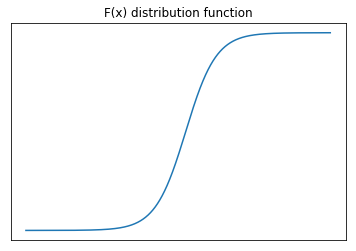
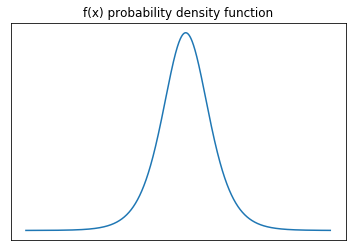

##逻辑回归算法

####1.逻辑斯蒂分布（logistic distribution）
假设$X$是连续随机变量，$X$如果满足以下条件:
$$F(x)=P(X\leq x)=\frac{1}{1+e^{\frac{-(x-\mu)}{\gamma}}}$$
$$f(x)=F'(x)=\frac{e^{\frac{-(x-\mu)}{\gamma}}}{\gamma(1+e^{\frac{-(x-\mu)}{\gamma}})^2}$$
则X服从逻辑斯蒂分布，其中$\mu$为位置参数，$\gamma>0$为形状参数。

其中概率分布函数$F(x)$形状如下：

概率密度函数形状如下:

####2.二项逻辑斯蒂回归模型
一般来说，回归模型是对连续值计算得到最近似的拟合函数。但是逻辑斯蒂回归模型不一样，虽然叫回归模型，但是实际上是计算分类的模型，用于计算二分类。

二项逻辑斯蒂回归模型是如下的概率分布:
$$P(Y=1|x)=\frac{exp(w\cdot x+b)}{1+exp(w\cdot x+b)}$$
$$P(Y=0|x)=\frac{1}{1+exp(w\cdot x+b)}$$

其中$x\in R^n$,即为n维实数向量；$Y\subset\{0,1\}$是输出，即为类别；$w\in R^n$和$b\in R$分别为权重和偏置，$w\cdot x$是两个向量的内积。

####3. 模型参数的计算

回顾上一章节的课程，SGD(批量梯度下降)算法，需要有很多的样本去计算参数。这里也是一样，对于给定的训练数据集$T=\{(x_1,y_1),(x_2,y_2),…,(x_n,y_n)\}$,其中$x_i\in R^n,y_i\in \{0,1\}$。

在这里计算参数$w$和$b$的时候，需要用到极大似然估计法计算。至于为什么要用极大似然估计法计算，这个可以自己去研究一下，作为遗留问题。

接下来，我们先设:
$$P(y_i=1|x_i)=\pi(x_i),P(y_i=0|x_i)=1-\pi(x_i)$$
合起来可以写为:
$$P(y_i|x_i;w)=\pi(x_i)^{y_i}[1-\pi(x_i)]^{1-y_i}$$
对所有的$N$个样本，有似然函数为:
$$\prod_{i=1}^{N}[\pi(x_i)]^{y_i}[1-\pi(x_i)]^{1-y_i}$$
此函数过于复杂，由于对数函数与原函数的单调性一致，因此这里一个技巧就是将上式取对数。则有:
$$L(w)=\frac{1}{N}\sum_{i=1}^N[y_ilog(\pi(x_i))+(1-y_i)log(1-\pi(x_i))]$$
其中$\frac{1}{N}$是求平均的系数，不影响函数的单调性。求上式的最大值，即是求$-L(w)$的最小值。

于是我们得到的目标函数就为$-L(w)=J(w)$,对上述式子进行梯度下降算法计算得到参数$\tilde{w},\tilde{b}$,就有:
$$P(y_i=1|x_i)=\frac{exp(\tilde{w}\cdot x_i+\tilde{b})}{1+exp(\tilde{w}\cdot x_i+\tilde{b})}$$
$$P(y_i=0|x_i)=\frac{1}{1+exp(\tilde{w}\cdot x_i+\tilde{b})}$$

我们可以得到每个样本$x_i$为0和1的概率，如果为1的概率大，那么$x_i$就被归结到1这个类别，否则就归结到0这个类别，0和1分别为类别的编码号。比如{好西瓜=1，坏西瓜=0}，或者{好房子=1，坏房子=0}。

####4. 随机梯度下降计算最佳参数
对$J(w)$求其梯度函数为：
$$\frac{\partial{J(w)}}{\partial(w)}=-\frac{1}{N} \sum_{i=1}^{N}[y_i\frac{\pi(x_i)'}{\pi(x_i)}+(1-y_i)\frac{-\pi(x_i)'}{1-\pi(x_i)}]$$

我们知道：
$$\pi(x_i)=\frac{exp(w\cdot x_i+b)}{1+exp(w\cdot x_i+b)}$$
令：
$$z=w\cdot x_i+b$$
所以:
$$\frac{\partial(z)}{\partial(w)}=x_i$$
则上式变为:
$$\frac{\partial{J(w)}}{\partial(w)}=\sum_{i=1}^{N}[y_i\frac{\pi(x_i)'}{\pi(x_i)}+(1-y_i)\frac{-\pi(x_i)'}{1-\pi(x_i)}]
=\sum_{i=1}^{N}[y_i\frac{\pi(z_i)'}{\pi(z_i)}+(1-y_i)\frac{-\pi(z_i)'}{1-\pi(z_i)}]\frac{\partial(z)}{\partial(w)}$$
我们知道:
$$\pi(z)'=\pi(z)(1-\pi(z))$$
代入上式得到:
$$\frac{\partial{J(w)}}{\partial(w)}=-\frac{1}{N}\sum_{i=1}^{N}[y_i-\pi(x_i)]x_i$$

于是得到梯度下降的公式为:
$$w:=w-\alpha \frac{1}{N} \sum_{i=1}^{N}[\pi(x_i)-y_i]x_i$$
用矩阵表示即为:
$$w:=w-\alpha \frac{1}{N} X^T[\pi(X)-Y]$$

####5. 随机梯度下降构造逻辑斯蒂回归模型
利用上述的推导和上一章节对梯度下降算法的理解，我们可以尝试自己构造逻辑斯蒂回归模型了。这里我们有一份关于女性乳腺癌的数据集。
具体可以查看示例代码。

