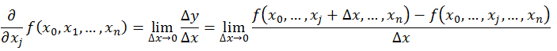
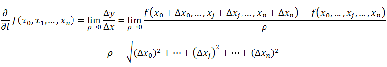
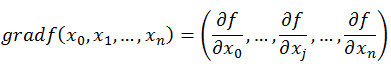
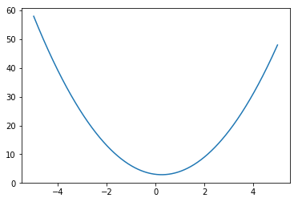
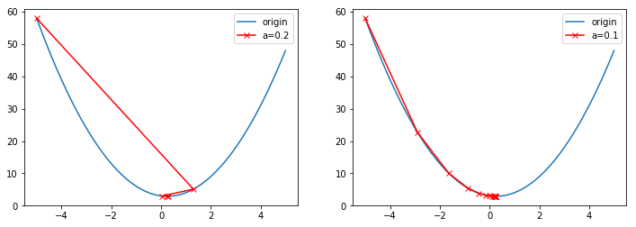
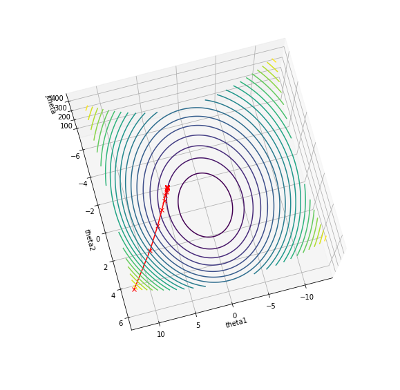
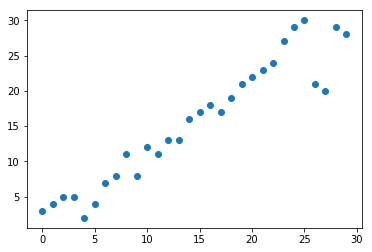

###随机梯度下降算法

**1.梯度下降算法的作用**
随机梯度下降算法，是用于求解机器学习算法参数的方法。梯度下降算法具体是什么呢？
1）导数
我们知道导数的定义如下：

=$\frac{\delta(y)}{\delta(x)}$

反映的是函数y=f(x)在某一点处沿x轴正方向的变化率。再强调一遍，是函数f(x)在x轴上某一点处沿着x轴正方向的变化率/变化趋势。直观地看，也就是在x轴上某一点处，如果f’(x)>0，说明f(x)的函数值在x点沿x轴正方向是趋于增加的；如果f’(x)<0，说明f(x)的函数值在x点沿x轴正方向是趋于减少的。
用图表示则如下：

上图中的Δy、dy等符号的意义及关系如下： 
Δx:x的变化量； 
dx:x的变化量Δx趋于0时，则记作微元dx； 
Δy:Δy=f(x0+Δx)-f(x0)，是函数的增量； 
dy:dy=f’(x0)dx，是切线的增量； 
当Δx→0时，dy与Δy都是无穷小，dy是Δy的主部，即Δy=dy+o(Δx). 

2）偏导数
上述导数的定义是针对单变量的，对于多变量的函数，如：$f(x,y,z,w)=x^2+y^2+z^2+w^2$,对某个变量求导，则得到该变量的偏导数。如：
$\frac{d(f)}{d(x)}=2x$,即为函数在变量x上的求导得到的导数。
偏导数的定义如下：

可以看到，导数与偏导数本质是一致的，都是当自变量的变化量趋于0时，函数值的变化量与自变量变化量比值的极限。直观地说，偏导数也就是函数在某一点上沿坐标轴正方向的的变化率。 
区别在于： 
导数，指的是一元函数中，函数$y=f(x)$在某一点处沿x轴正方向的变化率； 偏导数，指的是多元函数中，函数$y=f(x_1,x_2,…,x_n)$在某一点处沿某一坐标轴$(x_1,x_2,…,x_n)$正方向的变化率

3)方向导数
方向导数的定义如下：

方向导数就是函数在特定方向上的变化率，最大梯度是个

4)梯度
梯度的定义如下：

可见，梯度是一个向量，由各个分量上的导数所组成。梯度的方向就是最大方向导数的方向，梯度的模就是最大方向导数的值。

**2.梯度下降算法**
梯度下降算法是机器学习领域最常用的优化算法。通常机器学习的任务是：已知数据集$D=\{X_1,X_2,X_3,...,X_n\}$,其中$X_i \in R^m$是m维实数向量。然后已知一个目标函数，求目标函数的最佳参数，能够使得目标函数最优。

1）一维梯度下降算法示例
设当前有一个函数：$J(\theta)=2\theta^2-\theta+2$，其函数图像如下：

我们进行如下操作：
(a)计算$J(\theta)'=4\theta-1$
(b)令 $\alpha=0.2$,初始$\theta=2,$,然后不断重复$\theta=\theta-\alpha * J(\theta)'$,直到$|J(\theta)|<=0.01$
我们可以得到下图：

可见在左边图中，几个红色点的值在不断的减小，但是它是跳跃的，先左边，再到右边，最终到达底部。右边则是在单调往下。
同时我们可以看到，不同的$\alpha$下，下降的幅度不一样。$\alpha$大的时候下降快，小的时候下降慢。但是下降过快的时候，容易陷入震荡，一会儿跳到左边，一会儿在曲线右边，但是下降趋势不变。因此在很多算法里面，会将这个参数设置成可变，一开始下降快，然后慢慢变小。

2）二维梯度下降算法示例

假设损失函数为$J(\theta)=2\theta_1^2+5\theta_2^2$,求此式子下，使$J(\theta)$的参数$\theta_1,\theta_2$

那么我们进行如下操作：
(a)计算函数的梯度：$ΔJ(\theta)=(4\theta_1,10\theta_2)$,是一个向量
(b)进行梯度下降，$(\theta_1,\theta_2)=(\theta_1,\theta_2)-\alpha* ΔJ(\theta)$ 直到梯度中的每个值都小于0.01，输出最终终止时候的$(\theta_1,\theta_2)$

计算之后，可以得到效果图如下：

可见函数取值一直在往底部走，越来越接近最低点。

3）梯度下降算法实战
在实现了一维和二维梯度下降算法之后，我们下面进入到真实的梯度下降算法实践。以线性回归算法为例，假设我们有一系列下面的数据点：

想找到一个线性函数$h_\theta(x^i)=\theta_0*x_0^i+\theta_1*x_1^i$,使得$h_\theta(x)$能够尽可能准确的拟合该条曲线，因此我们有平方误差函数如下:
$J(\theta)=\frac{1}{2m}\displaystyle \sum_{i=1}^{m}(h_\theta(x^i)-y^i)^2$
其中$(h_\theta(x^i)$是预测值，$y^i$是真实值，我们的目标是得到参数$(\theta_0,\theta_2)$,使得$J(\theta)$能够最小。跟上面两个例子一样，先计算梯度，然后进行梯度下降。
计算梯度如下：
    $\frac{\delta(J(\theta))}{\theta_0}=\frac{1}{m} \displaystyle \sum_{i=1}^{m}(\theta_0*x_0^i+\theta_1*x_1^i-y^i)$
    $\frac{\delta(J(\theta))}{\theta_1}=\frac{1}{m} \displaystyle \sum_{i=1}^{m}(\theta_0*x_0^i+\theta_1*x_1^i-y^i)*x_1^i$
也是一个向量。这里不一样的是，有很多个$x$，所以是求和之后的平均。故而$J(\theta)$的梯度为：
$grad(J(\theta))=[\frac{1}{m} \displaystyle \sum_{i=1}^{m}(\theta_0*x_0^i+\theta_1*x_1^i-y^i),\frac{1}{m} \displaystyle \sum_{i=1}^{m}(\theta_0*x_0^i+\theta_1*x_1^i-y^i)*x_1^i]$

然后我们可以编写代码，计算一下在$\alpha=0.1$的时候，最优化的参数$\theta_0,\theta_1$分别是多少。

我们知道，对于二维坐标里的直线来说，$h_\theta(x^i)$的$x_0$是1，即为常数，$x_1$才是自变量。一般都是$y=ax+b$的形式，这里我们写的是一般形式的。但是这样写比较繁琐，所以我们以矩阵的形式来计算。

于是有$J(\theta)=\frac{1}{2m}(X^T\theta-Y)^T*(X^T\theta-Y)$

$\frac{\delta(J(\theta)}{\theta}=\frac{1}{2m}X(X^T\theta-Y)+\frac{1}{2m}(X^T\theta-Y)^TX^T$

由于矩阵运算满足：$(XY)^T=Y^TX^T$，因此对上式第二部分进行转换，则得到:

$\frac{1}{2m}(X^T\theta-Y)^TX^T=\frac{1}{2m}X(X^T\theta-Y)$,所以我们推得：

$\frac{\delta(J(\theta)}{\theta}=\frac{1}{m}X(X^T\theta-Y)$

于是我们得到梯度更新的公式，即为:

$\theta=\theta-\alpha*\frac{\delta(J(\theta))}{\theta}$

下面我们将此算法转换成代码如下：

**3.批量梯度下降算法**

**3.随机梯度下降算法**